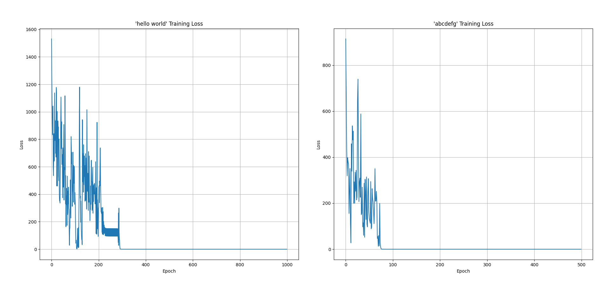

# RNN From Scratch

A pure NumPy implementation of a Recurrent Neural Network (RNN) for character-level text generation and sequence learning.

## Overview

This project implements a vanilla RNN from scratch using only NumPy, featuring:
- Forward propagation through time
- Backward propagation through time (BPTT) 
- Character-level text generation
- Training on sequential patterns
- Gradient clipping to prevent exploding gradients

## Project Structure

```
RNN-Scratch/
├── model/
│   ├── __init__.py
│   ├── rnn.py              # Core RNN implementation
│   └── character_rnn.py    # Character-level RNN wrapper
├── main.py                 # Demo script
└── README.md
```

## Mathematical Foundation

### Forward Propagation

The RNN forward pass computes the following equations at each time step \(t\):

1. **Pre-activation of hidden state:**
   ```math
   h^{\langle t \rangle} = W_{xh} \cdot x^{\langle t \rangle} + W_{ah} \cdot a^{\langle t-1 \rangle} + b_h
   ```

2. **Hidden state activation:**
   ```math
   a^{\langle t \rangle} = \tanh(h^{\langle t \rangle})
   ```

3. **Output pre-activation:**
   ```math
   o^{\langle t \rangle} = W_{ao} \cdot a^{\langle t \rangle} + b_o
   ```

4. **Output probabilities:**
   ```math
   \hat{y}^{\langle t \rangle} = \text{softmax}(o^{\langle t \rangle})
   ```

where:
- $x^{\langle t \rangle}$ is the input at time $t$
- $o^{\langle t \rangle}$ is non-normalized output at time $t$
- $a^{\langle t \rangle}$ is the activation at time $t$
- $h^{\langle t \rangle}$ is the hidden state at time $t$
- $W_{xh}, W_{ah}, W_{ao}$ are weight matrices
- $b_h, b_o$ are bias vectors

### Backward Propagation Through Time (BPTT)

The gradients are computed by backpropagating through time:

1. **Output gradient:**
   ```math
   \frac{\partial L^{\langle t \rangle}}{\partial o^{\langle t \rangle}} = \hat{y}^{\langle t \rangle} - y^{\langle t \rangle}
   ```

2. **Hidden state gradient:**
   ```math
   \frac{\partial L^{\langle t \rangle}}{\partial a^{\langle t \rangle}} = W_{ao}^T \cdot \frac{\partial L^{\langle t \rangle}}{\partial o^{\langle t \rangle}} + W_{ah}^T \cdot \frac{\partial L^{\langle t+1 \rangle}}{\partial h^{\langle t+1 \rangle}}
   ```

3. **Pre-activation gradient:**
   ```math
   \frac{\partial L^{\langle t \rangle}}{\partial h^{\langle t \rangle}} = \frac{\partial L^{\langle t \rangle}}{\partial a^{\langle t \rangle}} \cdot (1 - (a^{\langle t \rangle})^2)
   ```

4. **Weight gradients (accumulated across time):**
   ```math
   \frac{\partial L}{\partial W_{ao}} = \sum_{t=1}^{T} \frac{\partial L^{\langle t \rangle}}{\partial o^{\langle t \rangle}} \cdot (a^{\langle t \rangle})^T
   ```
   ```math
   \frac{\partial L}{\partial W_{ah}} = \sum_{t=1}^{T} \frac{\partial L^{\langle t \rangle}}{\partial h^{\langle t \rangle}} \cdot (a^{\langle t-1 \rangle})^T
   ```
   ```math
   \frac{\partial L}{\partial W_{xh}} = \sum_{t=1}^{T} \frac{\partial L^{\langle t \rangle}}{\partial h^{\langle t \rangle}} \cdot (x^{\langle t \rangle})^T
   ```

5. **Bias gradients:**
   ```math
   \frac{\partial L}{\partial b_o} = \sum_{t=1}^{T} \frac{\partial L^{\langle t \rangle}}{\partial o^{\langle t \rangle}}
   ```
   ```math
   \frac{\partial L}{\partial b_h} = \sum_{t=1}^{T} \frac{\partial L^{\langle t \rangle}}{\partial h^{\langle t \rangle}}
   ```

### Loss Function

The model uses cross-entropy loss:
```math
L^{\langle t \rangle} = -\sum_{i} y_i^{\langle t \rangle} \log(\hat{y}_i^{\langle t \rangle})
```

Total loss across the sequence:
```math
L = \sum_{t=1}^{T} L^{\langle t \rangle}
```

## Installation

1. Clone the repository:
```bash
git clone <repository-url>
cd RNN-Scratch
```

2. Install dependencies:
```bash
pip install numpy matplotlib
```

## Usage

### Basic Training

```python
from model import CharacterRNN

# Create a character-level RNN
char_rnn = CharacterRNN(hidden_dim=16, learning_rate=0.1)

# Train on a pattern
pattern = "hello world"
losses = char_rnn.train_on_text(pattern * 15, epochs=1000, print_every=100)

# Generate text
generated_text = char_rnn.generate_text('h', 50)
print(generated_text)
```

### Running the Demo

```bash
python main.py
```

This will:
1. Train two RNN models on different patterns ("hello world" and "abcdefg")
2. Display training progress and loss curves
3. Generate text samples from trained models

## Training Results

The RNN successfully learns to generate repeating patterns:



### Example 1: Learning "hello world"
- **Initial (Epoch 0)**: Random gibberish
- **Epoch 100**: Partial patterns with errors
- **Epoch 300+**: Perfect replication of "hello world" pattern

### Example 2: Learning "abcdefg"
- Faster convergence due to simpler alphabetical pattern
- Perfect generation achieved by epoch 100

## Architecture Details

- **Input Size**: 27 (alphabet + space)
- **Hidden Size**: Configurable (default: 16)
- **Output Size**: 27 (same as input for character prediction)
- **Activation**: Tanh for hidden states, Softmax for outputs
- **Optimization**: SGD with gradient clipping ([-5, 5])

## Key Features

- **Pure NumPy Implementation**: No deep learning frameworks required
- **Gradient Clipping**: Prevents exploding gradient problem
- **Character-level Processing**: Works with any text input
- **Text Generation**: Sample from learned probability distributions
- **Visualization**: Training loss plots for monitoring convergence

## Limitations

- **Vanishing Gradients**: Limited ability to capture long-term dependencies
- **Sequential Processing**: Cannot be parallelized like modern architectures
- **Simple Architecture**: No gating mechanisms (vs. LSTM/GRU)

## License

This project is licensed under the MIT License - see the [LICENSE](LICENSE) file for details.

## Contributing

Contributions are welcome! Please feel free to submit a Pull Request.